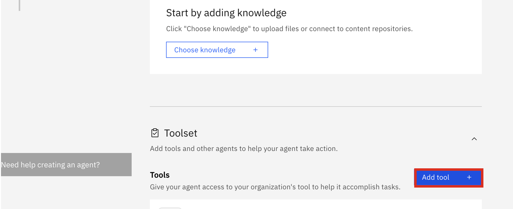
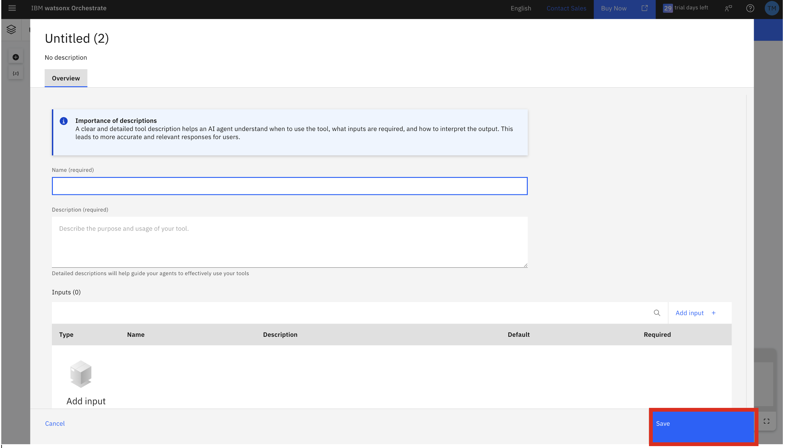

# Document Comparison with watsonx Orchestrate AI Agent


Ever spent hours combing through two nearly identical contracts, just to find that one sneaky clause that changed everything?  

In this hands-on bootcamp, we’ll show you how to let AI do the heavy lifting. Discover how IBM’s watsonx Orchestrate AI Agent can revolutionize document comparison, turning a tedious manual task into a fast and reliable workflow.

## What You’ll Learn

In this session, you’ll:
* Learn how to orchestrate workflows in watsonx Orchestrate using a custom AI Agent and tool.
* Extract document differences through chatting to the agent.
* Discuss the possibility of using additional pre-built agents.


## Use Case: Contract Review Accelerator

Imagine you’re part of a legal team reviewing two versions of a vendor contract:
* Version A from last quarter
* Version B just received today

Instead of manually comparing every clause, your watsonx Orchestrate agent works for you:
1.	Extracts document terms.
2.	Feeds the content to the agent, which applies semantic matching and highlights critical differences (e.g., pricing, liability, renewal terms).
3.	Generates a summary report for immediate review.

In minutes, you’ll know what changed, why it matters, and what to do next.

## watsonx Orchestrate

### Environment setup
To get to the watsonx Orchestrate console, go the [Resources list on the IBM Cloud homepage](https://cloud.ibm.com/resources).


Expand the `AI / Machine Learning` section and select the resource that has `watsonx Orchestrate` in the Product column, as shown above. Next, click on the `Launch watsonx Orchestrate` button.


This opens the watsonx Orchestrate console.


### UI walkthrough

> When opening the console for the very first time, you may be greeted by a pop-up window offering that you create your first agent. Click on `Skip for now`.


In the console, it shows that no agents have been deployed yet. Thus, if you interact with watsonx Orchestrate at this point, not much will happen, since the system has no agents available to route any request to.

Go ahead and chat with watsonx Orchestrate to explore what type of answers it gives to your questions.

### Create an agent 
We are now ready to build the first agent. In the watsonx Orchestrate console, click on either `Create or Deploy` or `Create new agent` (either will get you to the same place).


However, if you add your document as the knowledge base in agent, it will be able to do tasks like summarization. 


#### The Legal Contract Comparison Agent
In the following screen, click on `Create agent`.


On the following page, you can select if you want to create the new agent from scratch or from a template, and give it a name and a description.

 Let's start by giving it a name and a description:
- Name: Legal Contract Comparison Agent
- Description: 
```
This agent is used to compare the differences between the legal contract documents provided.
```

Note that in the world of AI Agents, these descriptions are not merely used as documentation, they are also used in making decisions about selecting the right agent for the job, so what you enter into this field is important.

After you have entered the required information, click on `Create`.


On the following screen, we can enter more information about the new agent we are building. Agents can rely on `Knowledge`, on a `Toolset` that consists of one or more `Tools` and one or more `Agents` to satisfy a request that is sent to them. Moreover, you can pick the `AI Model` that it uses under the covers, as well as the `Agent style` and the `Voice modality`. We can define all of those elements here. 
- `Knowledge` represents information that is stored in the form of "embeddings" in a so-called Vector Store. Whenever the agent answers a request, it can choose to run a search against the connected Knowledge repository (i.e. the Vector Store) to search for information that can assist in answering the request. You can either upload documents directly here, or connect the agent to an already existing repository. Note that once again, the "Description" field is key, because it will help the agent decide whether to run a search against the knowledge.
- The `Toolset` contains other components that the agent can delegate certain tasks to. 
  - `Tools` are functions an agent can call. It can be either an API call or an invocation of custom code. This allows to extend the agent's capabilitiy beyond what the LLM has been trained with.
  - `Agents` are other agents, either within watsonx Orchestrate or running externally, e.g., in watsonx.ai that this agent can delegate the request, or part of a request, to.

Moreover, you can specify the Large Language Model that the agent will use, as well as the "style" of the agent. For this agent, we will pick the `llama-3-405b-instruct` model and keep the `Default` style.


#### Adding OpenAPI tool




Download the [OpenAPI tool](read-url-openapi.json) and upload here


#### Create Agentic Workflow

We will create an agentic worlkflow and import it as tool to be used by the agent.

Lets go ahead and create an agentic workflow.


**Step 1:** Provide `Name` and `Description` of the workflow. 
- Name: ```document comparison tool```
- Description: 
```
Compare between legal documents
```



**Step 2:** Start adding steps by clicking on the '+' button.


**Step 3:** Click on '+' and then select 'User activity' -> 'Display to user' -> 'Message'

**Step 4**: Double click on message and add the below 'Output message'
```
Upload the original contract      
```

**Step 5:** Click on '+' and then select 'Interactions' -> 'File Upload'

**Step 6:** Update the title of 'File Upload' 
```
Upload the original Contract Testing
```

**Step 7:** Outside of the box, again click on '+' and then select 'User activity' -> 'Display to user' -> 'Message'

**Step 8**: Double click on message and add the below 'Output message'
```
Upload the modified contract          
```

**Step 9:** Outside of the box, again click on '+' and then select 'User activity' -> 'Display to user' -> 'Message'

**Step 10**: Double click on message and add the below 'Output message'
```
Extracting the content from the original contract
```

**Step 11:** Outside of the box, again click on '+' and then 'Text extractor' 

**Step 12:** Edit and modify the title of the 'Text extractor' 
```
Text extractor original
```

**Step 13:** Click on 'Edit data mapping' -> remove 'Auto-map' -> click on 'Variable' symbol -> add output of 'File upload 1'

**Step 14:** Outside of the box, again click on '+' and select 'Tools' and use OpenAPI tool 'Fetch text content from URL' 

**Step 15**: Copy and update tool title 
```
'Fetch text content from URL original' 
```

**Step 16:** Click on 'Edit data mapping' and remove 'Auto-map' -> click on 'Variable' symbol -> add output of 'Fetch text content from URL original'
 
**Step 17:** Outside of the box, again click on '+' and then select 'User activity' -> 'Display to user' -> 'Message'

**Step 18:** Double click on message and add the below 'Output message'

**Step 19:** Double click on message and add the below 'Output message'
```
Extracting the content from the modified contract
```
**Step 20:** Outside of the box, again click on '+' and then 'Text extractor' 

**Step 21:** Edit and modify the title of the 'Text extractor' 
```
Text extractor modified
```
**Step 22:** Click on 'Edit data mapping' -> remove 'Auto-map' -> click on 'Variable' symbol -> add output of 'File upload 2'

**Step 23:** Outside of the box, again click on '+' and select 'Tools' and use OpenAPI tool 'Fetch text content from URL' 

**Step 24**: Copy and update tool title 
```
'Fetch text content from URL modified' 
```

**Step 25:** Click on 'Edit data mapping' and remove 'Auto-map' -> click on 'Variable' symbol -> add output of 'Fetch text content from URL modified'
 
**Step 26:** Outside of the box, again click on '+' and then select 'User activity' -> 'Display to user' -> 'Message'

**Step 27**: Double click on message and add the below 'Output message'
```
Comparing the document contents
```

**Step 28:** Outside of the box, again click on '+' and then select 'Generative prompt'

**Step 29:** In Define prompts, click 'Add' -> add 'original_document_content' and 'modified_document_content'

**Step 30:** Copy and add in 'System prompt' and 'User prompt'
System prompt:
```
You are an expert Legal Contract Document Comparison Agent.
You will be provided with two legal contract documents:

 - Original Document
 - Modified Document

Your task is to perform a line-by-line comparison to identify all changes made in the Modified Document compared to the Original Document.

**Requirements for your output:**

Clearly highlight differences, including additions, deletions, and modifications of any sections.

Output format : The output should be well structured in the below format

1. (Title of the difference)
    - Specify the section under which there is a difference
    - Original Text
    - Modified Text
    - Nature of Change (Added / Removed / Altered)

and so on for all differences

DO's
- The response should directly begin with the formatted output structre specified above and nothing else.

DONT's

- DO NOT include unrelated commentary—focus strictly on the differences.
- DO NOT repeat the differences, if they appear at multiple places
```

User prompt:
```
Here are below the original and modified version of the same document I want you to compare

1. Original Document content : {self.input.original_document_content}

2. Modified Document content : {self.input.modified_document_content}
```

**Step 31:** Click on 'Adjust LLM settings' , update 'New tokens' to 2000.
Check 'Manually set the creating threshold settings' -> Set Temperature 0.1, Top K 5, Top P 0.95 -> Select model 'llama-3-405b-instruct'


**Step 32:** Double click on 'Generative prompt' -> click on 'Edit data mapping' and remove 'Auto-map' -> click on 'Variable' symbol -> add output of 'Fetch text content from URL original' and 'Fetch text content from URL modified'

**Step 33:** Finally click on 'Done' to get the flow to import as a tool.


## Credits
<details><summary>IBM Client Engineering Team</summary>

#### Business Technical Leader 
* Vincent Lee

#### Instructors
* Zack Phillips
* Pengxiang Xu
* Kyle Skyllingstad
* Chaithra M. Nagaraj
* Vrisan Dubey

#### AI Engineers
* M N Navneeth
* Tiyasa Mukherjee
* Fidha Haneefa
* Kousalya V

#### Designer
* Amy Luo

</details>

<details><summary> IBM Brand Team </summary>

#### Brand Technical Specialist
* Bill Tice
* Jishnu Desai

#### Brand Sales Specialist
* Pete Ingrasci

#### Account Technical Leader
* Effron Esseiva
  
</details>
