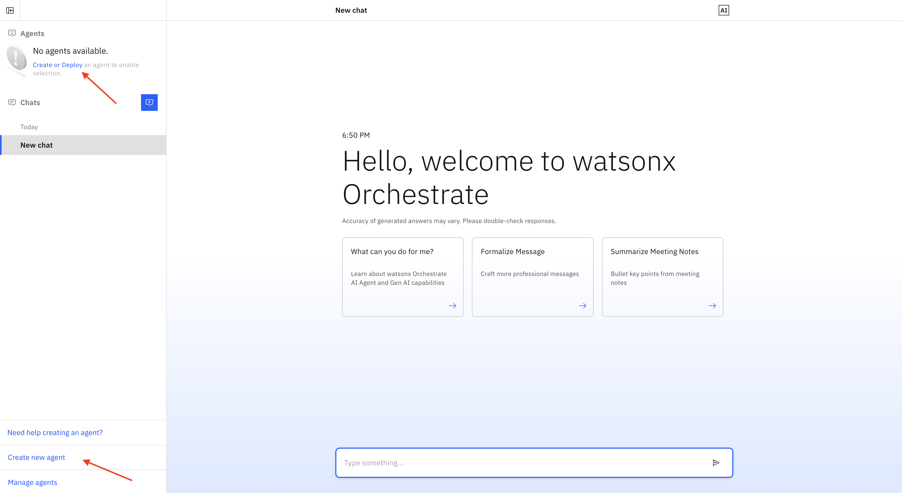

# Document Comparison with watsonx Orchestrate AI Agent

Ever spent hours combing through two nearly identical contracts, just to find that one sneaky clause that changed everything?  

In this hands-on bootcamp, we’ll show you how to let AI do the heavy lifting. Discover how IBM’s watsonx Orchestrate AI Agent can revolutionize document comparison, turning a tedious manual task into a fast and reliable workflow.

## What You’ll Learn

In this session, you’ll:
* Learn how to orchestrate workflows in watsonx Orchestrate using a custom AI Agent and tool.
* Extract document differences through chatting to the agent.
* Discuss the possibility of using additional pre-built agents.

## Use Case: Contract Review Accelerator

Imagine you’re part of a legal team reviewing two versions of a vendor contract:
* Version A from last quarter
* Version B just received today

Instead of manually comparing every clause, your watsonx Orchestrate agent works for you:
1.	Extracts document terms.
2.	Feeds the content to the agent, which applies semantic matching and highlights critical differences (e.g., pricing, liability, renewal terms).
3.	Generates a summary report for immediate review.

In minutes, you’ll know what changed, why it matters, and what to do next.

## watsonx Orchestrate

To get to the watsonx Orchestrate console, go the [Resources list on the IBM Cloud homepage](https://cloud.ibm.com/resources).

Expand the `AI / Machine Learning` section and select the resource that has `watsonx Orchestrate` in the Product column, as shown above. Next, click on the `Launch watsonx Orchestrate` button.

This opens the watsonx Orchestrate console.

### The watsonx Orchestrate console

> When opening the console for the very first time, you may be greeted by a pop-up window offering that you create your first agent. Click on `Skip for now`.

In the console, it shows that no agents have been deployed yet. Thus, if you interact with watsonx Orchestrate at this point, not much will happen, since the system has no agents available to route any request to.

However, you can already interact with the Large Language Model (LLM) that works behind the scenes, and ask general questions, like "How are you today?" or "What is the capital of France?". 

Go ahead and chat with watsonx Orchestrate to explore what type of answers it gives to your questions.

### AI Agent Configuration
We are now ready to build the first agent. In the watsonx Orchestrate console, click on either `Create or Deploy` or `Create new agent` (either will get you to the same place).

### The Legal Contract Comparison Agent
In the following screen, click on `Create agent`.

## Credits

IBM Client Engineering Team

#### Business Technical Leader 
* Vincent Lee

#### Instructors
* Zack Phillips
* Pengxiang Xu
* Kyle Skyllingstad
* Chaithra M. Nagaraj
* Vrisan Dubey

#### AI Engineers
* M N Navneeth
* Tiyasa Mukherjee
* Fidha Haneefa
* Kousalya V

#### Designer
* Amy Luo

 IBM Brand Team 

#### Brand Technical Specialist
* Bill Tice
* Jishnu Desai

#### Brand Sales Specialist
* Pete Ingrasci

#### Account Technical Leader
* Effron Esseiva
  

