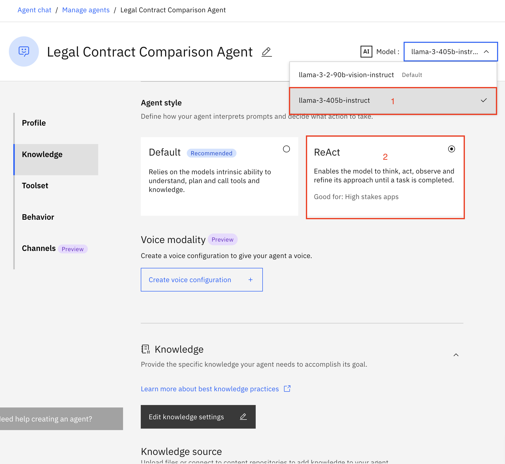
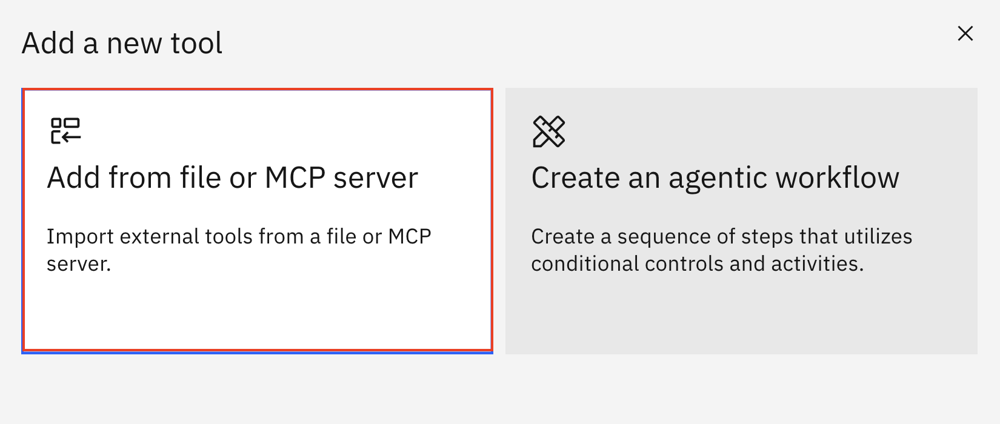
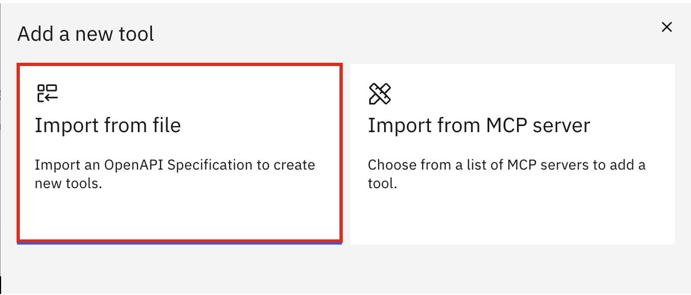
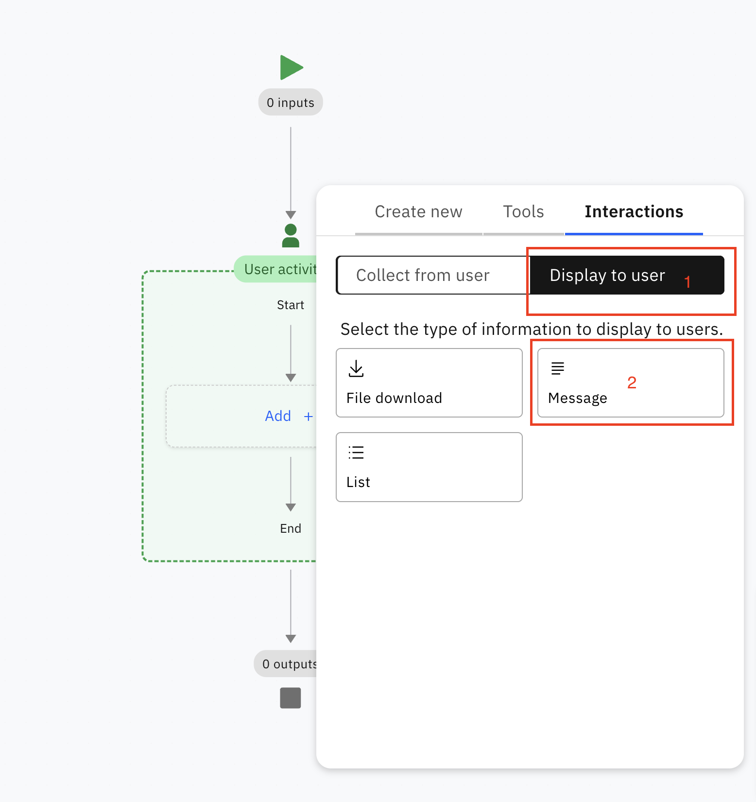
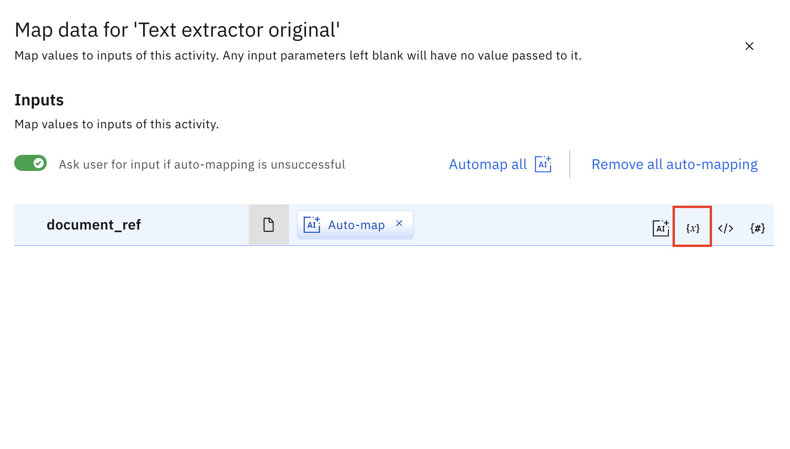
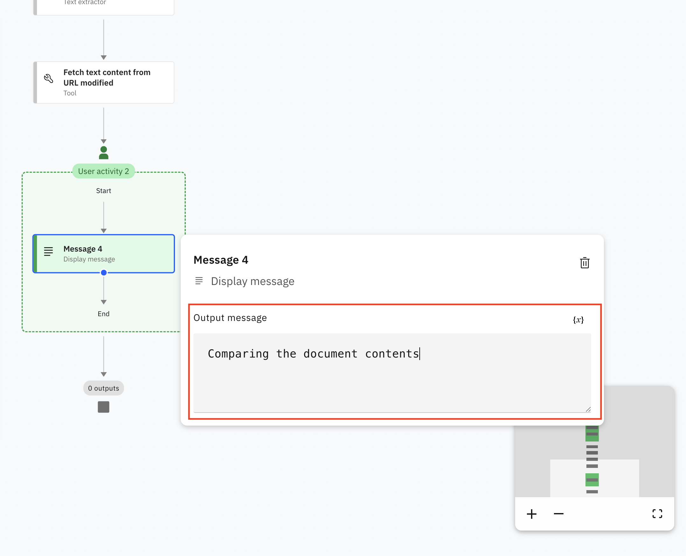
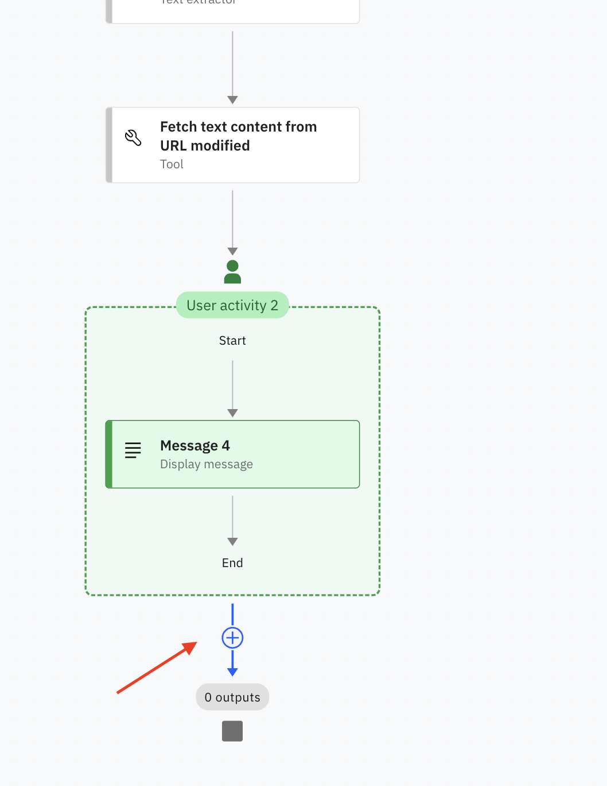
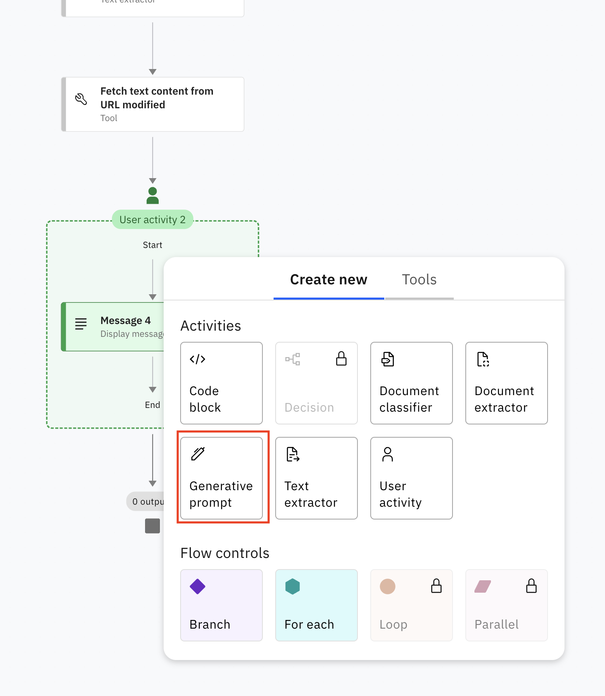
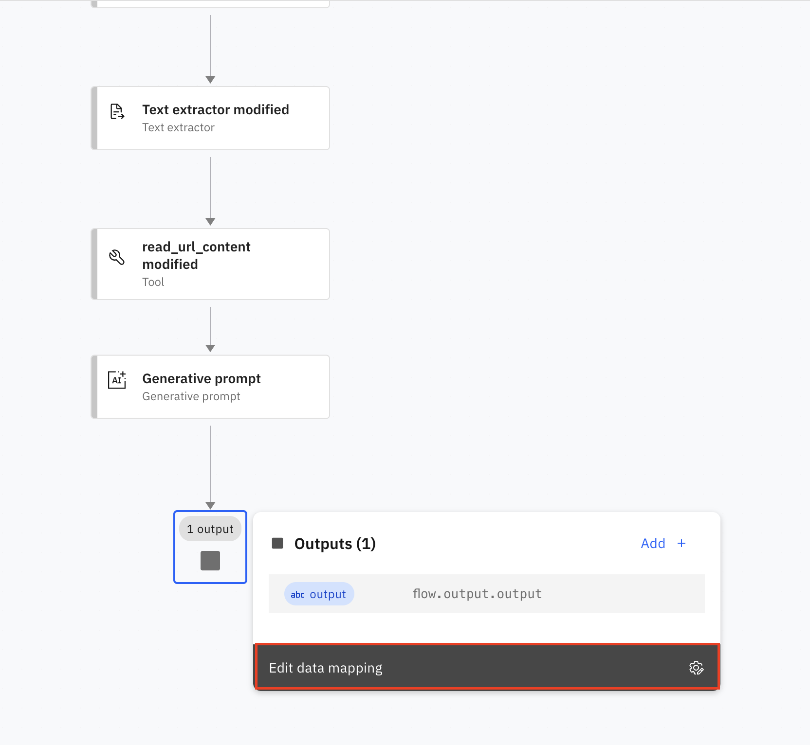
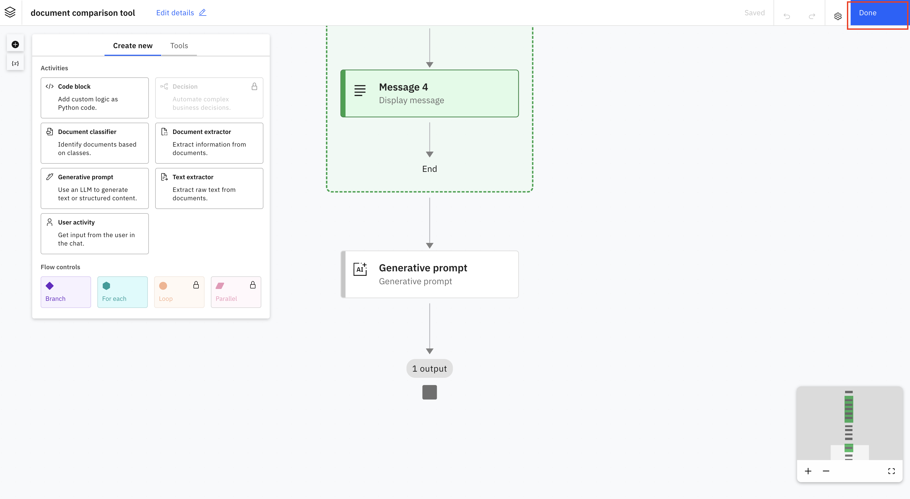

## Table of Contents
- [1. Environment setup](#Environment_setup)
- [2. UI Wakthrough (Optional)](#UI_walkthrough)
- [3. Create an agent](#Create_an_agent)
- [4. The Legal Contract Comparison Agent](#The_Legal_Contract_Comparison_Agent)
  - [4.1 Initial Setup](#initial_setup)
  - [4.2 Adding an OpenAPI Tool](#adding_openapi_tool)
  - [4.3 Create Agentic Workflow](#create_agentic_workflow)
  - [4.4 Update Agent Behavior](#update_agent_behavior)
  - [4.5 Test the Agent](#test_agent)
  - [4.6 Deploy the Agent (Optional)](#deploy_agent)
- [5. Summary](#summary)

## Downloadables

Ensure you download these below files and keep them handy since we will be using them as part of the lab.

1. [Master Services Agreement - ACME Corp. 462390.docx](<documents/Master Services Agreement - ACME Corp. 462390.docx>)
2. [Modification Master Services Agreement - ACME Corp. 462390.docx](<documents/Modification Master Services Agreement - ACME Corp. 462390.docx>)
3. [read-url-openapi.json](<documents/read-url-openapi.json>)

<details open id="Environment_setup">
<summary><h2>1. Environment setup</h2></summary>

1. To access the watsonx Orchestrate console, go to the [Resources list on the IBM Cloud homepage](https://cloud.ibm.com/resources).

  

2. Expand the **AI / Machine Learning** section and select the resource that has **watsonx Orchestrate** in the Product column, as shown above. Then click **Launch watsonx Orchestrate**.

  

This opens the watsonx Orchestrate console.

  

[← Back to Table of contents](#table-of-contents)
</details>

<details open id="UI_walkthrough">
<summary><h2>2. UI walkthrough (Optional)</h2></summary>

When opening the console for the first time, you may see a pop-up prompting you to create your first agent. Click **Skip for now**.

  

The console shows that no agents have been deployed yet. If you interact with watsonx Orchestrate at this point, not much will happen because the system has no agents available to process requests.

Go ahead and chat with watsonx Orchestrate to see how it responds.

[← Back to Table of contents](#table-of-contents)
</details>

<details open id="Create_an_agent">
<summary><h2>3. Create an agent</h2></summary>

You are now ready to build your first agent. In this section, you will create a Knowledge Base Agent that can answer user questions by retrieving information from uploaded documents.

1. In the watsonx Orchestrate console, click either **Create or Deploy** or **Create new agent**. Both options lead to the same page.

  

2. Enter the following in the **Name** field:

   ```
   Knowledge Base Agent
   ```

3. Enter the following in the **Description** field:

   ```
   This agent responds to the user query using the available information from the knowledge base.
   ```

4. Click **Create**.

  

**Knowledge** represents information stored as embeddings in a Vector Store. When the agent receives a request, it can search the connected knowledge repository to find relevant information. You can upload documents or link to an existing repository. Once again, the description field helps the agent decide whether a knowledge search is relevant.

If you add your document as a knowledge base for the agent, it will be able to perform tasks such as summarization and Q&A with the documents.

5. Click **Knowledge** on the left menu or scroll down to the Knowledge section, then click **Choose Knowledge**.

  

6. Select **Upload Files** and click **Next**.

  

7. Click **Drag and drop files here or click to upload**. Upload any file as your knowledge, for example [Master Services Agreement - ACME Corp. 462390.docx](<documents/Master Services Agreement - ACME Corp. 462390.docx>), and click **Next**.

  

8. Add the following description and click **Save**:

   ```
   This document is a Master Services Agreement between ACME and Mango Corporation.
   ```

  

9. Now start asking questions. For example:

   ```
   summarize the contract document
   ```
   
   

[← Back to Table of contents](#table-of-contents)
</details>

<details open id="The_Legal_Contract_Comparison_Agent">
<summary><h2>4. The Legal Contract Comparison Agent</h2></summary>

This section demonstrates how to build a legal contract comparison agent that analyzes original and modified contracts to identify key differences and changes.


<details open id="initial_setup">
<summary><h3>4.1 Initial Setup</h3></summary>

1. Go to the [watsonx Orchestrate homepage](https://us-south.watson-orchestrate.cloud.ibm.com/chat).

2. Click **Create agent**.

  

You can choose to create the agent from scratch or from a template, once you select the type you will need to provide a name and description for your agent.

Start by entering the following:

3. **Name:**

  ```
  Legal Contract Comparison Agent
  ```
4. **Description:**

  ```
  This agent is used to compare the differences between the legal contract documents provided.
  ```

In AI agent design, descriptions are not only documentation. They are used by the system to decide which agent to route a request to, so this field is important.

5. After entering the required information, click **Create**.

  

On the next screen, you can configure additional details about your agent.

* Agents can work with **Knowledge**, a **Toolset** (which includes Tools and Agents), or both, to satisfy incoming requests.
* You can also choose the **AI model**, the **agent style**, and the **voice modality**.

You can configure all of these elements here.


* The **Toolset** contains components the agent can delegate tasks to.

  * **Tools** are functions the agent can call, such as APIs or custom code, extending the agent’s capabilities beyond what the LLM knows.
  * **Agents** are other agents, either within watsonx Orchestrate or external (such as watsonx.ai agents), that can handle a request or parts of it.

6. You can select the **Large Language Model** the agent uses and the **style**. For this agent, select **llama-3-405b-instruct** and keep the **Default** style.



[← Back to Table of contents](#table-of-contents)
</details>

<details open id="adding_openapi_tool">
<summary><h3>4.2 Adding an OpenAPI Tool</h3></summary>

Next step is to add the required tool for this agent. To add a tool:

1. Click **Manage agents** at the top.

  

2. Click **All tools** in the left panel, then click **Create tool**.

  

3. Select **Add from file or MCP server**.

  

4. Click **Import from file**.

  

5. Click **Drag and drop an OpenAPI file here or click to upload.**

  

6. Upload the **OpenAPI tool file** downloaded in the beginning : [read-url-openapi.json](documents/read-url-openapi.json).

  

7. **Select the checkbox** next to the operation name and click **Done**.

  

[← Back to Table of contents](#table-of-contents)
</details>

<details open id="create_agentic_workflow">
<summary><h3>4.3 Create Agentic Workflow</h3></summary>

We will create an agentic workflow and import it as a tool to be used by the agent.


Let’s go ahead and create this workflow.

1. Click **Add agents** on the left, then click the **Legal Contract Comparison Agent** you created earlier.

  

2. Scroll down to the **Toolset** tab and click **Add Tool**.

3. Select **Create an agentic workflow**.

   

4. Click the pencil icon next to **Edit details**.

  

5. Provide a **Name** and **Description** for the workflow, then click **Save**.

   * Name:

     ```
     document comparison tool
     ```
   * Description:

     ```
     Compare between legal documents
     ```

  

6. Click the **+** button to start adding steps.

  

7. Select **User activity**.

  

8. Click **Add +**.

  

9. From the **Display to user** tab, select **Message**.

  

10. Double-click the message and add the following text in the **Output message** field:

```
Upload the original contract
```

  

11. Click **+** again.

  

12. From the **Collect from user** tab, select **File upload**.

  

13. Double-click **File upload**, hover over **File upload 1**, and click the pencil icon.

  

14. Update the title to:

```
Upload the original Contract
```

Then click the checkmark.

  

15. Click **+**.

  

16. From **Display to user**, select **Message**.

17. Double-click the message and enter:

```
Upload the modified contract
```

  

18. Click **+**.

  

19. From **Collect from user**, select **File upload**.

20. Double-click it, hover over **File upload 1**, and click the pencil icon.

21. Update the title to:

```
Upload the modified contract
```

  

22. Click **+**.

  

23. From **Display to user**, select **Message**.

24. Double-click the message and enter:

```
Extracting the content from the original and modified contract
```

  

25. Outside the User Activity box, click **+**.

  

26. From **Create new**, select **Text extractor**.

  

27. Double-click **Text extractor 1**, hover over it, and click the pencil icon.

  

28. Update the title to:

```
Text extractor original
```

  

29. Click **Edit data mapping**.

  

30. Hover over to the **document_ref** row and click the **{x}** icon.

  

31. From the left panel, select **Upload the original contract**.

  

32. Click **value**.

  

33. Close the dialog.

  

34. Click **+**.

  

35. Open the **Tools** tab and click the **+** icon next to **Fetch text content from URL**.

  

36. Double click **Fetch text content from URL**, hover over it, and click the pencil icon.

37. Update the title to:

```
Fetch text content from URL original
```

  

38. Click **Edit data mapping**.

  

39. Hover over to the **url** row and click the **{x}** icon.

  

40. From the left, select **Text extractor original**, then select **output_file_ref**.

  

41. Click the close button.

  

42. Click **+** again and, from the **Create new** tab, select **Text extractor**.

43. Double-click **Text extractor 2**, hover over it, and click the pencil icon.

44. Update the title to:

```
Text extractor modified
```

  

45. Click **Edit data mapping**.

46. Hover over to the **document_ref** row and click the **{x}** icon.

47. From the left panel, select **Upload the modified contract**, then click **value**.

  

48. Click the close button.

  

49. Click **+**.

50. Open the **Tools** tab and click the **+** icon next to **Fetch text content from URL**.

51. Double-click **Fetch text content from URL**, hover over it, and click the pencil icon.

52. Update the title to:

```
Fetch text content from URL modified
```

  

53. Click **Edit data mapping**.

54. Hover over to the **url** row and click the **{x}** icon.

55. From the left, select **Text extractor modified**, then select **output_file_ref**.

  

56. Click the close button.

57. Click **+**.

58. Select **User activity**.

59. Click **Add +**.

60. From the **Display to user** tab, select **Message**.

61. Double-click the message and enter the following in **Output message**:

```
Comparing the document contents
```

  

62. Outside the User Activity box, click **+**.

  

63. From the **Create new** tab, select **Generative prompt**.

  

64. Click the pencil icon next to **Prompt Settings**.

  

65. Under **Define Prompts**, click **Add**.

  

66. Select **String**.

  

67. Under **Name**, enter:

```
original_document_content
```

68. Click **Add**.

  

69. Add another input with the following name:

```
modified_document_content
```

  

70. For the **system prompt**, enter the following:

```
You are an expert Legal Contract Document Comparison Agent.
You will be provided with two legal contract documents:

- Original Document
- Modified Document

Your task is to perform a line-by-line comparison to identify all changes made in the Modified Document compared to the Original Document.

Requirements for your output:

Clearly highlight differences, including additions, deletions, and modifications of any sections.

Output format: The output should be well structured in the below format:

1. (Title of the difference)
    - Specify the section under which there is a difference
    - Original Text
    - Modified Text
    - Nature of Change (Added / Removed / Altered)

and so on for all differences.

DOs
- The response should directly begin with the formatted output structure specified above and nothing else.

DON’Ts
- DO NOT include unrelated commentary. Focus strictly on the differences.
- DO NOT repeat differences if they appear in multiple places.
```
67. For the **user prompt**, enter the following:

```
Here are the original and modified versions of the same document that I want you to compare.

1. Original Document content: {self.input.original_document_content}

2. Modified Document content: {self.input.modified_document_content}
```

  

68. Click **Adjust LLM settings** and set **New tokens** to **2000**.
69. Enable **Manually set the creative threshold settings**.

  

70. Set **Temperature** to **0.1**, **Top K** to **5**, and **Top P** to **0.95**.
71. Select the model **llama-3-405b-instruct**.

  

72. Click **Edit data mapping**.

  

73. Hover over to the **modified_document_content** row and Click the **{x}** icon present in that row.
74. From the left panel, select **Fetch text content from URL modified**, then click **file_content**.

  

75. Hover over to the **original_document_content** Crow and Click the **{x}** icon present in that row.
76. From the left panel, select **Fetch text content from URL original**, then click **file_content**.

  

77. Click the close button.

  

78. Double click on the **Output** node.
79. Click on the **Add** button.

  

80. Select **String**

  

81. In the **Name** field, enter the following and click the **Add** button
  ```
  output
  ```
  

83. Click **Edit data mapping**.

  

84. Hover over to the **output** row and Click the **{x}** icon present in that row.

  

85. From the left panel, select **Generative prompt**, then click **value**.

  

86. Click the close button.

  

87. You have now completed the workflow. Click **Done** to close the flow.

  

[← Back to Table of contents](#table-of-contents)
</details>

<details open id="update_agent_behavior">
<summary><h3>4.4 Update Agent Behavior</h3></summary>

Before testing the agent, complete the Behavior section. Scroll to **Behavior** or select the **Behavior** tab on the left.

Add the following instructions:

```
If the user asks to compare documents
-> Invoke the `document_comparison_tool`
Display the output response of the tool back to the user
```

  

[← Back to Table of contents](#table-of-contents)
</details>

<details open id="test_agent">
<summary><h3>4.5 Test the Agent</h3></summary>


1. Test your agent by entering the following query in the chat:

  ```
  I want to compare my legal contract documents.
  ```

2. The agent will ask you to upload your original contract: [Master Services Agreement - ACME Corp. 462390.docx](<documents/Master Services Agreement - ACME Corp. 462390.docx>)

3. Next, it will ask you to upload your modified contract:
[Modification Master Services Agreement - ACME Corp. 462390.docx](<documents/Modification Master Services Agreement - ACME Corp. 462390.docx>)

**Estimated Time for Comparison Result : 1.5 - 2 minutes**

4. You will see messages indicating:

  **Extracting the content from the original and modified contract**, followed by
  **Comparing the document contents**.

  

5. The results should look similar to the image below:

  

[← Back to Table of contents](#table-of-contents)
</details>

<details open id="deploy_agent">
<summary><h3>4.6 Deploy the Agent (Optional)</h3></summary>

In this section, we will deploy the Legal Contract Comparison Agent along with the tool and workflow created earlier. Deployment ensures that the agents are accessible through watsonx Orchestrate chat and ready to handle real-time queries.

To deploy the Legal Contract Comparison Agent 

1. Turn on the toggle button for Home page so that your agent shows up in the watsonx Orchestrate Chat home page, once deployed.

  

2. Click the **Deploy** button in the top-right corner to deploy your agent.

  

3. Click the **Deploy** button in the bottom-right corner of Pre-deployment summary page.

  

4. To test the agent from the AI Chat window, click on the hamburger menu in the top left corner and then click on Chat.

  

5. Make sure your Legal Contract Comparison Agent is selected in the dropdown. You can now test your agent.

  

[← Back to Table of contents](#table-of-contents)
</details>

</details>

<details open id="summary">
<summary><h2>5. Summary</h2></summary>

In this lab we automated the process of comparing two versions of a legal contract and highlighting the differences between them. We built a custom agent in watsonx Orchestrate, added an OpenAPI-based tool, and created an agentic workflow that guides the user through uploading the original and modified documents. The workflow then extracts text from both files, retrieves the content through the custom tool, and feeds the results into a generative prompt that produces a structured comparison of additions, deletions, and modifications. This provides a clear, reliable summary of every change made between contract versions.

The workflow can be extended with additional steps, such as automatically notifying reviewers, generating a change-impact summary, or triggering downstream approval processes. Using an agentic workflow ensures the comparison is handled consistently every time, while still allowing the agent to involve the legal reviewer whenever intervention is needed.

Combining agentic workflows with tools and task-level actions gives the agent the flexibility to handle both simple and multi-step processes. Users can chat with the agent to perform individual tasks, or rely on the workflow to manage complex document review operations from start to finish.

[← Back to Table of contents](#table-of-contents) | [← Back to Main page](../README.md)
</details>
